#微信爬虫程序
本微信爬虫程序基于fiddler和appium，实现全自动爬取给定微信公众号所有历史文章，包括阅读数，点赞数，评论数。
##主要思路
1. 通过微信公众号文章引用可以获得任意一个微信公众号所有文章的链接，因此我们需要手动登录微信公众号平台，查询某个公众号文章，fiddler会自动获取
登录cookie和token，保存到fiddler-token-public.log文件中，之后就不需要再操作微信公众号平台了。

2. 通过点击微信文章，我们可以用fiddler抓包工具截获requests信息，获取key，appmsg_token等参数，将这些参数加到文章链接再用POST
方法可以获得点赞、阅读、评论等信息。

3. key，appmsg_token等信息可以用在同一公众号的不同文章，但每隔一段时间会失效，需要重新点击文章。我用文章阅读数来判断参数是否失效，如果
某一页文章阅读数都为0，说明参数已失效，需要重新获取参数，我使用appium模拟人工点击公众号文章，fiddler会自动抓取所需参数，保存到fiddler-token.log文件中。
程序从中获取参数，继续工作。

4. 抓取信息用mongoDB保存，可以导入到excel文件，再通过excel2json将excel转换为json格式。

#所需工具及依赖包
##所用工具
1. fiddler4
2. appium
3. 夜神安卓模拟器
4. 微信6.7.3
5. mongoDB
##python依赖包安装
+ appium
+ selenium
+ requests_html
+ requests
+ pymongo
+ urllib3
#环境配置
##fiddler4安装
1. 下载地址https://www.telerik.com/download/fiddler，一步步安装好

2. 打开fiddler，tools->options->https

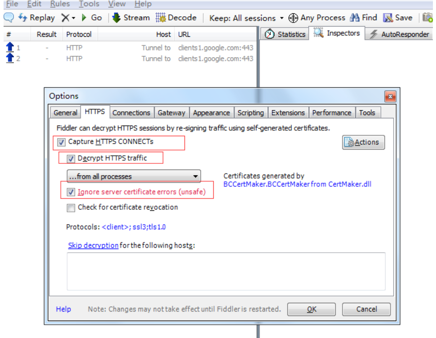

再点旁边的antions，将证书导入到桌面，安装证书

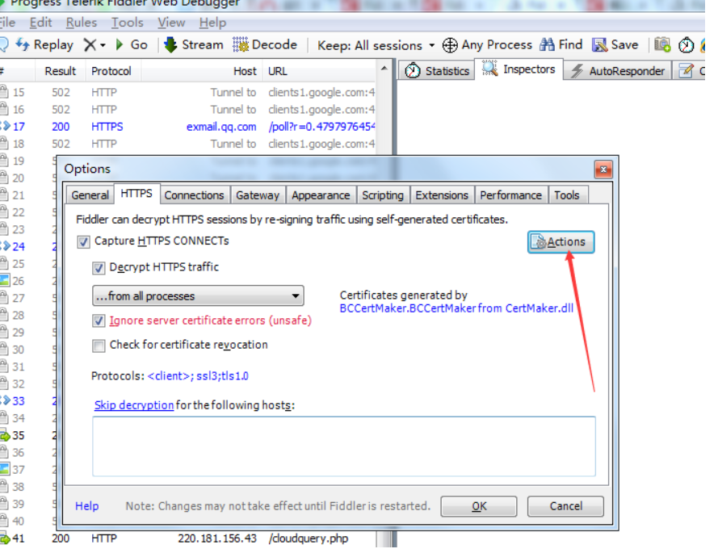

connections设置

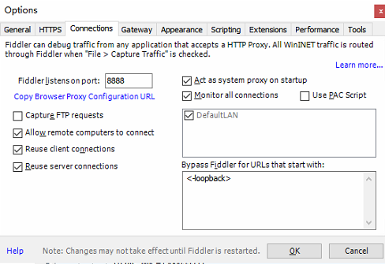

3. 设置抓取特定网页请求，要求在登录微信公众号搜索公众号文章后自动保存登录cookie和token到目录的fiddler-token-public.log，以及在点击微信文章时，自动将
appmsg_token, pass_ticket, biz, cookie保存到fiddler-token.log。为此需要在rules中的customize rules中添加规则

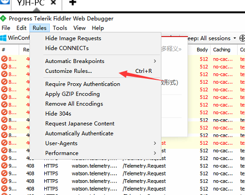

**这里filename需要改为自己的文件目录**
 
 
    //获取公众号登陆信息
    if (oSession.HostnameIs("mp.weixin.qq.com") && oSession.uriContains("https://mp.weixin.qq.com/cgi-bin/appmsg?token=")){  
        var filename = "D:/0AfileofYoung/Workplace/wechat_crawler4/fiddler-token-public.log";  
        var curDate = new Date();  
        var logContent =  "[" + curDate.toLocaleString() + "] " + oSession.PathAndQuery + "\r\n"+oSession.oRequest["Cookie"]+"\r\n";  
        var aa : System.IO.StreamWriter;  
        aa = System.IO.File.CreateText(filename);  
        aa.Write(logContent); 
        aa.Close();  
        aa.Dispose();  
    }
    //获取手机抓包信息，会在filename处生成一个文件
    if (oSession.HostnameIs("mp.weixin.qq.com") && oSession.uriContains("https://mp.weixin.qq.com/mp/getappmsgext")){  
        var filename = "D:/0AfileofYoung/Workplace/wechat_crawler4/fiddler-token.log";  
        var curDate = new Date();  
        var logContent =  "[" + curDate.toLocaleString() + "] " + oSession.PathAndQuery + "\r\n"+oSession.oRequest["Cookie"]+"\r\n"+oSession.oRequest["Referer"]+"\r\n" ;  
        var sw : System.IO.StreamWriter;  
        sw = System.IO.File.CreateText(filename);  
        sw.Write(logContent); 
        sw.Close();  
        sw.Dispose();  
    } 

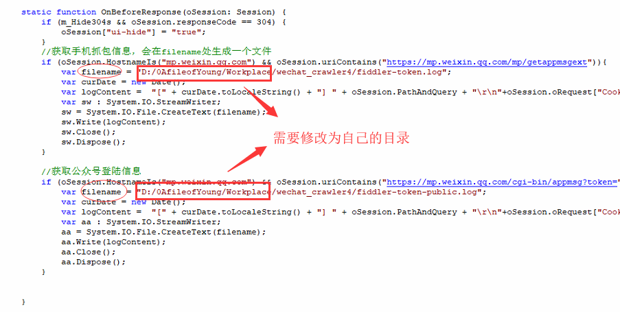

4.手机设置fiddler：

**第一步**:手机和电脑需要连接在同一个局域网，打开手机浏览器，输入http://ip:端口号，ip可以在电脑上通过ipconfig获得，端口号默认设置为8888

**第二步**：点击FiddlerRootcertificate下载证书

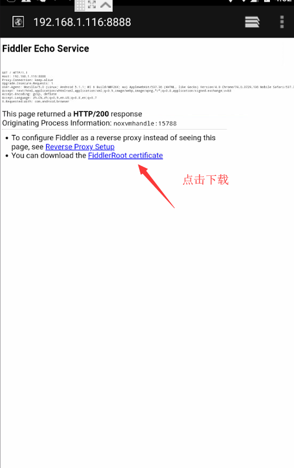

**第三步**：更改手机无线网的代理
手机系统设置-无线网-点击高级，代理选择手动，主机名就是fiddler的电脑ip地址，端口号，就是fiddler的端口号，与浏览器中ip：端口号保持一致，点击确定即可

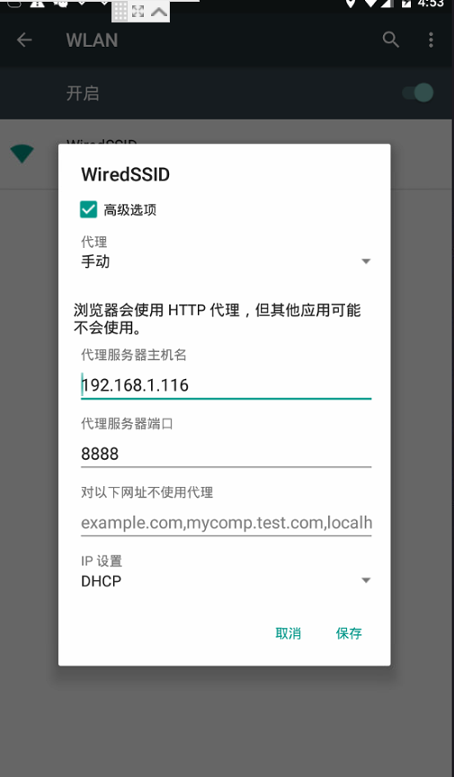

5.手机输入ip:端口号加载不出来网页，可能是电脑没开代理，也可能是防火墙拦截了

1）打开chrome的代理设置，打开局域网设置，设置如下

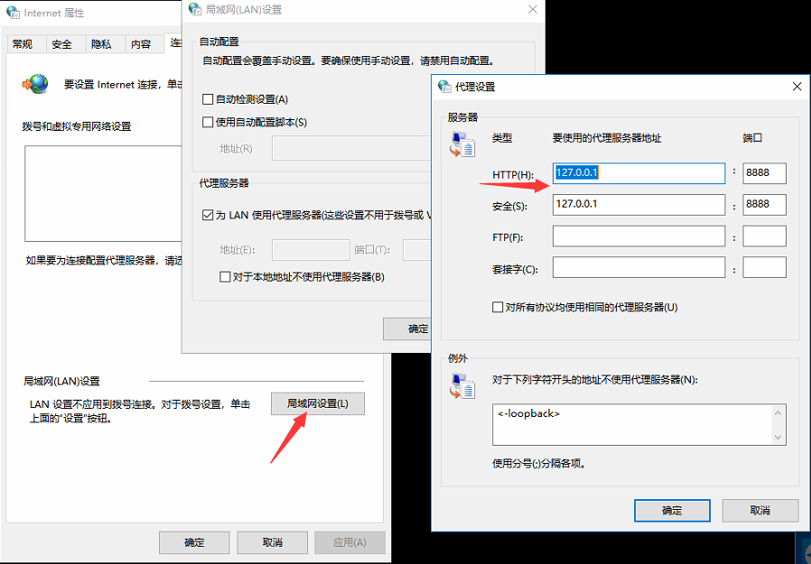

2）控制面板打开Windows防火墙，允许网络通过fiddler

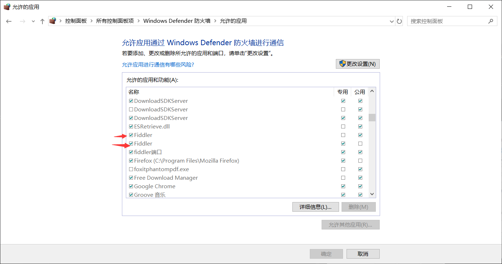

接下来fiddler就可以正常抓取手机的包了

##appium安装
1. 桌面版下载安装https://github.com/appium/appium-desktop/releases

2. android SDK安装与配置，还需要配置一下环境变量，添加ANDROID_HOME为Android SDK 所在路径，然后再添
加SDK文件夹下的tools和platform-tools文件夹到PATH中

3. 打开appium

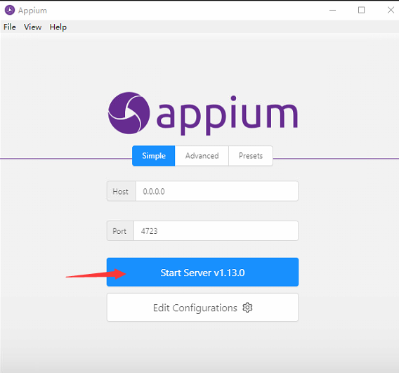

##夜神安卓模拟器

1. 下载安装：https://www.yeshen.com/

2. 将分辨率设置为手机版，否则appium调试手机的时候页面会变倒

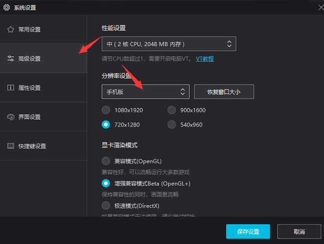

3. 在夜神模拟器中下载微信6.7.3并安装

##mongoDB安装

1. 下载安装：https://www.runoob.com/mongodb/mongodb-window-install.html

2. mongoDB可视化工具Robo 3T下载安装：https://robomongo.org/

3. 开启mongoDB服务
 
 #执行步骤
 1. 打开fiddler，修改fiddler rules并设置好手机端抓包，使fiddler可以抓取到手机网络信息。
 
 2. 开启appium服务，确保appium可以操纵手机，若不可以，请参考appium连接夜神模拟器： https://blog.csdn.net/oHuaXin1234/article/details/80988177
  
 3. 开启mongoDB服务。
 
 4. 打开下载微信6.7.3，提前关注好需要爬取的微信公众号。
 
 5. 登录微信公众号平台，若没有个人订阅号，可以申请一个，在公众号平台新建群发->转载文章->超链接->查找文章->输入公众号->点击公众号，此时跳出该微信公众号所有历史
文章。
 
 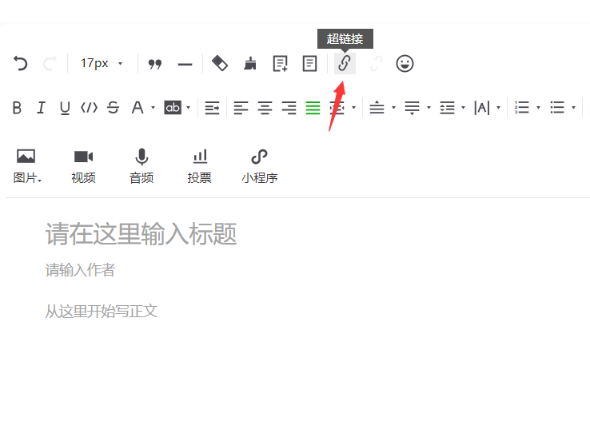
 
 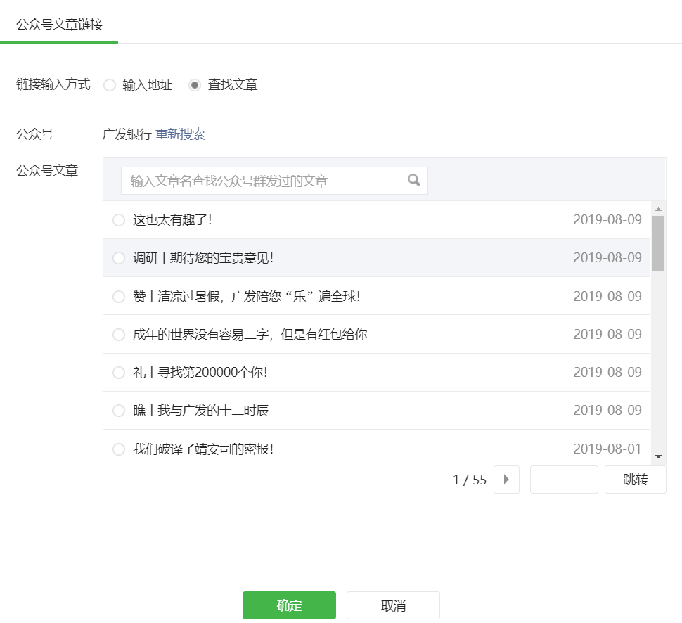
 
 6. 在main文件lists中填入所爬公众号名字，运行main文件即可自动爬取所给公众号所有历史文章。
 

  